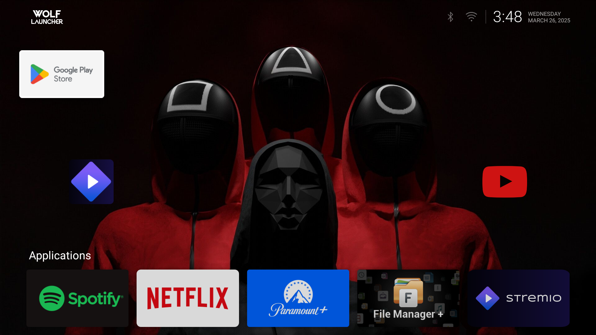

# Ooredoo DIW387 STB Mod Toolkit

This project documents and automates the process of customizing and partially unlocking a hard-locked Ooredoo DIW387 set-top box running Android TV OS with a Broadcom BCM7271U SoC. It covers UI mods, launcher replacement, boot splash animations, and Dirty COW-based root attempts.

## 📸 Preview

Here’s what the customized Setup Box looks like after cleanup and setup:



## Disclaimer
> This repo is for educational purposes only. Modifying your device may void your warranty, break system functionality, or violate local laws. Proceed at your own risk.

---

## 📦 Project Structure

- `CVE-2016-5195` – Dirty COW privilege escalation attempt
- `cleanup.sh` – Installs Wolf Launcher, disables stock bloat, sets up launcher
- `Youtube.sh` – Sets up SmartTubeNext, File Explorer, custom icons, splash, etc.

---

## 🚀 Quickstart
```bash
git clone https://github.com/yourusername/ooredoo-stb-mod.git
cd ooredoo-DIW387-mod
chmod +x *.sh
./cleanup.sh
./Youtube.sh
# Optional: If you want root access and your model hasnt been updated by ooreedoo / ISP which uses Broadcom BCM7271U.
# Try CVE-2016-5195
```

---

## Requirements
- ADB installed on your Mac/Linux/Windows
- USB Debugging enabled on the STB
- Some steps require physical access to the box
- Dirty COW (CVE-2016-5195) may not work on all builds

---

## Confirmed Working 
- Wolf Launcher as default
- Custom launcher 
- SmartTubeNext (ad-free YouTube)
- File Explorer + sideloaded APKs


---

## 👑 Optional Features
- Custom bootanimation.zip (only if rooted)
- UART serial mods (advanced)
- Root access via Dirty COW (testing only)

---

## 📬 Credits
- Dirty COW exploit by @firefart, @timwr, @marcograss
- Wolf Launcher
- Author: Abhinav
